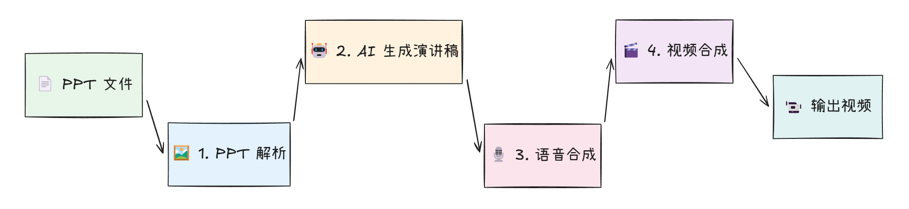
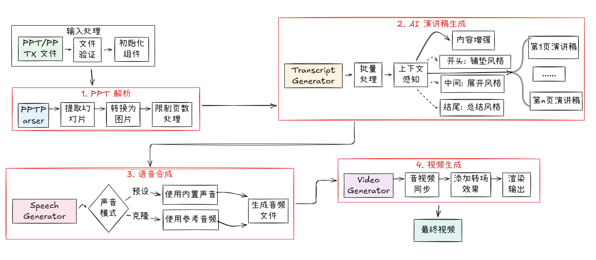

# Agentic PPT to Speech Video Generator

<div align="center">

**一个基于 AI Agent 的智能 PPT 转视频工具**，能够深度理解演示文稿内容，自动生成专业演讲稿并合成高质量视频。

[](https://www.python.org/)
[](LICENSE)
[](https://github.com/MinJung-Go/Agentic-PPT2Speech/issues)

[核心特性](#核心特性) • [快速安装](#快速安装) • [快速开始](#快速开始) • [配置选项](#配置选项) • [项目结构](#项目结构) • [处理流程](#处理流程) • [高级功能](#高级功能) • [故障排除](#故障排除) • [贡献指南](#贡献指南) • [许可证](#许可证)

</div>

---

## 核心特性

### AI Agent 驱动
- **深度内容理解**：AI Agent 能够理解 PPT 的整体结构和逻辑关系
- **上下文感知**：批量处理时保持演讲内容的连贯性和递进关系
- **智能适配**：根据幻灯片位置（开头、中间、结尾）自动调整演讲风格

### 智能演讲稿生成
- **专业水准**：生成的演讲稿达到专业演讲者水平
- **详细展开**：每页演讲稿确保 2 分钟以上的讲解内容
- **自然过渡**：智能生成页面间的过渡语句

### 高质量语音合成
- **多引擎支持**：Edge-TTS、Azure TTS、GTTS 等
- **声音克隆**：支持基于参考音频的声音克隆（实验性功能）
- **参数调节**：语速、音调、音量精细控制

### 专业视频输出
- **高清输出**：支持 1080p 视频输出
- **平滑过渡**：幻灯片间自然过渡效果
- **音视频同步**：精确的音画同步

## 环境要求

- Python 3.8+
- FFmpeg（用于视频处理）
- 4GB+ RAM（推荐 8GB）

## 快速安装

### 1. 克隆仓库
```bash
git clone https://github.com/MinJung-Go/Agentic-PPT2Speech.git
cd Agentic-PPT2Speech
```

### 2. 创建虚拟环境
```bash
# 使用 venv
python -m venv venv
source venv/bin/activate  # Linux/Mac
venv\Scripts\activate     # Windows

# 或使用 conda
conda create -n ppt2speech python=3.8
conda activate ppt2speech
```

### 3. 安装依赖
```bash
# 基础安装
pip install -r requirements.txt

# 完整安装（包含所有可选功能）
pip install -e ".[dev,azure,ml]"
```

### 4. 安装 FFmpeg
```bash
# Ubuntu/Debian
sudo apt update && sudo apt install ffmpeg

# MacOS
brew install ffmpeg

# Windows
# 从 https://ffmpeg.org/download.html 下载并添加到 PATH
```

### 5. 配置 API 密钥
```bash
cp .env.example .env
# 编辑 .env 文件，添加必要的 API 密钥和配置
```

必需配置：
- `OPENAI_API_KEY`: OpenAI API 密钥
- `SPEECH_DEVELOPER_SECRET`: 语音服务开发者密钥
- `SPEECH_OPEN_ID`: 语音服务 Open ID
（请联系FAP平台进行申请）

## 快速开始

### 一行命令转换

#### 基础转换
```bash
python run_pipeline.py --ppt data/Agent.pptx --context "AI技术分享"
```

#### 语音克隆转换
```bash
python run_pipeline.py --ppt data/Agent.pptx --config configs/voice_clone.json
```

> **说明**：
> - 第一个命令使用默认配置，生成标准 AI 语音
> - 第二个命令使用语音克隆配置，生成与参考音频相似的声音（已预设"民酱"声音样本）
> - 两个命令都会在 `output` 目录生成完整的演讲视频

### Python API 使用
```python
from core.pipeline import PPTToVideoPipeline

# 基础使用
pipeline = PPTToVideoPipeline()
video_path = pipeline.process_sync(
    ppt_path="your_presentation.pptx",
    presentation_context="这是一个关于人工智能的技术分享"
)

# 异步处理（推荐用于大文件）
import asyncio

async def convert_ppt():
    pipeline = PPTToVideoPipeline()
    video_path = await pipeline.process(
        ppt_path="presentation.pptx",
        presentation_context="技术分享会演讲",
        progress_callback=lambda p, msg: print(f"{msg}: {p*100:.1f}%")
    )
    return video_path

# 运行异步任务
video = asyncio.run(convert_ppt())
```

## 配置选项

### 预设配置

```python
from configs import PipelineConfig

# 默认配置 - 平衡质量和速度
config = PipelineConfig()

# 高质量配置 - 最佳输出质量
config = PipelineConfig.from_preset("high_quality")

# 英文配置 - 英文演讲优化
config = PipelineConfig.from_preset("english")

# 声音克隆配置 - 使用自定义声音
config = PipelineConfig.from_preset("voice_clone")
```

### 自定义配置

```python
config = PipelineConfig(
    # AI 模型设置
    ai_model="gpt-4",              # 使用更强大的模型
    max_tokens=1500,               # 更长的演讲稿
    temperature=0.8,               # 更有创意的内容
    
    # 语音设置
    voice_id="zh-CN-YunxiNeural", # 选择不同的声音
    speech_speed=1.1,              # 稍快的语速
    speech_volume=0.9,             # 音量调节
    
    # 视频设置
    video_resolution=(1920, 1080), # Full HD
    video_fps=30,                  # 更高帧率
    transition_duration=0.8,       # 转场时长
    
    # 处理设置
    batch_size=5,                  # 批处理大小
    save_intermediates=True,       # 保存中间文件
)
```

## 项目结构

```
Agentic-PPT2Speech/
├── configs/                   # 配置文件
│   ├── default.json          # 默认配置
│   ├── english.json          # 英文配置
│   ├── high_quality.json     # 高质量配置
│   └── voice_clone.json      # 声音克隆配置
├── core/                     # 核心模块
│   ├── pipeline/             # 处理流水线
│   ├── ppt_parser/           # PPT 解析
│   ├── transcript_generator/ # AI 演讲稿生成
│   ├── speech_generation/    # 语音合成
│   └── video_generation/     # 视频生成
├── data/                     # 示例数据
│   └── resources/            # 音频资源
├── utils/                    # 工具函数
├── run_pipeline.py           # 命令行入口
└── requirements.txt          # 依赖列表
```

## 处理流程

### 主流程图



### 详细流程




### 核心模块功能

| 模块 | 功能 | 关键特性 |
|------|------|----------|
| **PPT 解析** | 将 PPT 转换为图片序列 | • 高 DPI 渲染<br/>• 支持 PPT/PPTX<br/>• 页数限制 |
| **AI 演讲稿** | 智能生成演讲内容 | • 上下文感知<br/>• 位置自适应<br/>• 内容增强 |
| **语音合成** | 文本转语音 | • 多引擎支持<br/>• 声音克隆<br/>• 参数调节 |
| **视频合成** | 组合音视频 | • 平滑转场<br/>• 音画同步<br/>• 高清输出 |

## 高级功能

### 声音克隆

#### 命令行使用
```bash
# 使用预设的声音克隆配置
python run_pipeline.py --ppt data/Agent.pptx --config configs/voice_clone.json

# 或者指定自定义音频文件
python run_pipeline.py --ppt data/Agent.pptx --config configs/voice_clone.json \
    --reference-audio "path/to/your/voice.wav" \
    --reference-text "参考音频的文本内容"
```

#### Python API 使用
```python
config = PipelineConfig.from_preset("voice_clone")
config.reference_audio_path = "path/to/your/voice.wav"
config.reference_text = "参考音频的文本内容"

pipeline = PPTToVideoPipeline(config)
video = pipeline.process_sync(
    ppt_path="presentation.pptx",
    presentation_context="使用克隆声音的演讲"
)
```

> **提示**：voice_clone.json 配置文件已预设了示例音频（data/resources/民酱.m4a），您可以直接使用或替换为自己的音频文件。

### 批量处理优化
```python
config = PipelineConfig(
    batch_size=10,              # 增大批处理大小
    max_slides=50,              # 限制最大页数
    min_transcript_length=300,  # 确保内容充实
)
```

### 视频效果增强
```python
config = PipelineConfig(
    fade_in=1.0,               # 淡入效果
    fade_out=1.0,              # 淡出效果
    transition_duration=1.0,    # 转场时长
)
```

## 故障排除

### 常见问题

1. **FFmpeg 未找到**
   ```bash
   # 检查 FFmpeg 安装
   ffmpeg -version
   ```

2. **API 密钥错误**
   - 确保 `.env` 文件中的 `OPENAI_API_KEY` 正确
   - 检查 API 密钥是否有效

3. **内存不足**
   - 减小 `batch_size`
   - 限制 `max_slides`

4. **生成的演讲稿太短**
   - 增加 `min_transcript_length`
   - 提供更详细的 `presentation_context`

## 性能优化

- **使用异步处理**：对于大型 PPT 文件
- **调整批处理大小**：根据内存情况优化
- **启用缓存**：避免重复处理
- **使用 GPU**：如果可用，加速视频处理

## 贡献指南

我们欢迎各种形式的贡献！

1. Fork 项目
2. 创建特性分支 (`git checkout -b feature/AmazingFeature`)
3. 提交更改 (`git commit -m 'Add some AmazingFeature'`)
4. 推送到分支 (`git push origin feature/AmazingFeature`)
5. 开启 Pull Request

## 许可证

本项目采用 MIT 许可证 - 详见 [LICENSE](LICENSE) 文件


<p align="center">
  如果这个项目对您有帮助，请给个 Star！
</p>
